# EasyUI

## Message
This project represents a significant investment of time, effort, and resources.  
It is now released as a fully open-source project for the community to use, improve, and build upon.

It may look simple on the surface, but a substantial amount of work has gone into its development.  
This is a contribution in support of open-source.

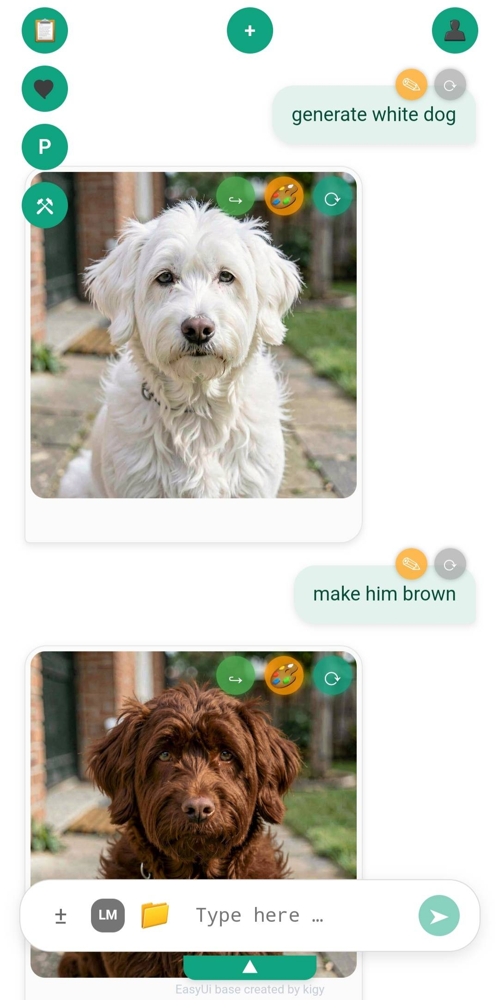

---

## What is EasyUI?

Instead of relying entirely on AI or large language models, EasyUI uses structured commands as a fast and practical way to interact with models, workflows, and code.

As the name suggests, EasyUI is designed to make AI accessible and simple for everyone—including family and friends—without requiring them to deal with complex code or node-based systems.  
It also helps organize ideas and workflows efficiently.

---

## Overview

EasyUI is a lightweight web interface that provides:
- Interaction with ComfyUI workflows  
- Execution of Python scripts  
- Integration with language models (via Ollama or similar tools) 
- Multi-language support (Arabic, English, Chinese, Japanese) 

---

## License

This project is based on the MIT License, with an additional UI attribution requirement.

You are free to use, modify, and distribute this project, including for commercial use.

However, you must keep the following credit in the user interface:
"EasyUI base made by kigy
Full license terms are provided in the LICENSE file.


---

## Installation

1. Clone the repository:
```bash
git clone https://github.com/kigy1/EasyUI.git
```
2. Run install_easyui.bat
3. Done. You can now run it with start.bat.

## How to Make It Work

EasyUI needs to know:
- which node you want to modify  
- and which keyword (intent) will trigger it  

For example, you might use the word **generate** to trigger an image generation workflow.  
To make it more flexible, you can add multiple keywords (intents) in the intents file.

Next, you define what should be modified in the workflow.  
For example, if you only want to change the prompt, you specify which node receives the prompt in `workflow_requirements.yml`.

Don’t worry—there is a tool that automates this process, so you don’t need to edit these files manually.

---

### Steps

1. From ComfyUI, export your workflow using **Export (API)**.

2. Place the workflow file inside the `workflows` folder (`main`, `high`, or `fast`).

3. Run `workflow_intent_requirements_builder.py` from the `tool` folder:
   - Select your workflow and click **Load**  
   - Enter the node numbers you want to interact with (e.g., prompt, image, etc.)

The result will be sent directly to EasyUI.  
If you need multiple outputs or something is missing, you can manually enter node numbers on save or result.

> **Note:** If the workflow is open in ComfyUI, it will help you identify node numbers more easily.

- To output all images, click **All Images**
- Use commas to add multiple intents

> **Note:** The UI automatically removes the intent keyword and keeps only the prompt.  
> If you want to keep the intent in the prompt, enable **No Remove** (useful for editing workflows).

Finally, click **Generate**, then **save the file**.

> **Note:** Other buttons are available to help you share your workflow with others.  

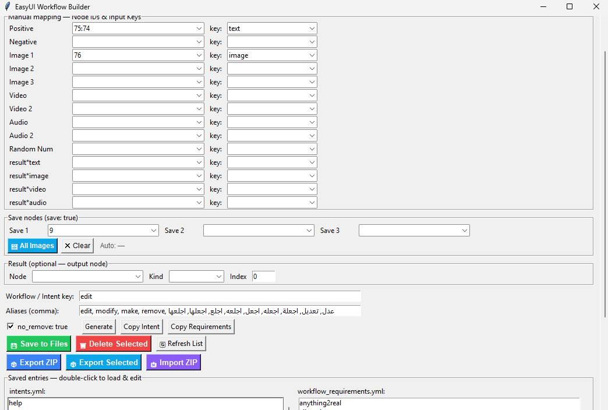

---

## Features

1. Send & receive: text, images, video, and audio  
2. Acts as a UI for running ComfyUI workflows  
3. Auto-translation (currently Arabic only)  
4. Blocked words filter  
5. Session management (create / restore / delete)  
6. Media cleanup from server  
7. Controls and toggles:
   - Login system  
   - Dark mode  
   - LLM model control  
   - EasyTag feature  
8. Tag system features:
   - Tags  
   - Wildcards  
   - Chants  
   Inspired by: https://github.com/DominikDoom/a1111-sd-webui-tagcomplete  
9. Button to chat with a LLM model  
10. Support for negative prompts via +/- button  
11. Template system  
12. Favorite templates  
13. Custom commands ("My Commands")  
14. Plugin system  
15. Drag & drop media upload  
16. Image cropping  
17. Mask editor (inpainting)  
18. Drawing and coloring tools  
19. Click-to-copy text  
20. Edit and resend prompts  
21. Regenerate output  
22. Resend image  
23. Run Python files  
24. Model selector (main / fast / high)  
25. Intent detection  
26. Multi-language support (Arabic, English, Chinese, Japanese)  
27. Auto-replies via text file  
28. Audio trimming  

---

## Screenshots and guide

### txt2img ,img2img , img2vid
  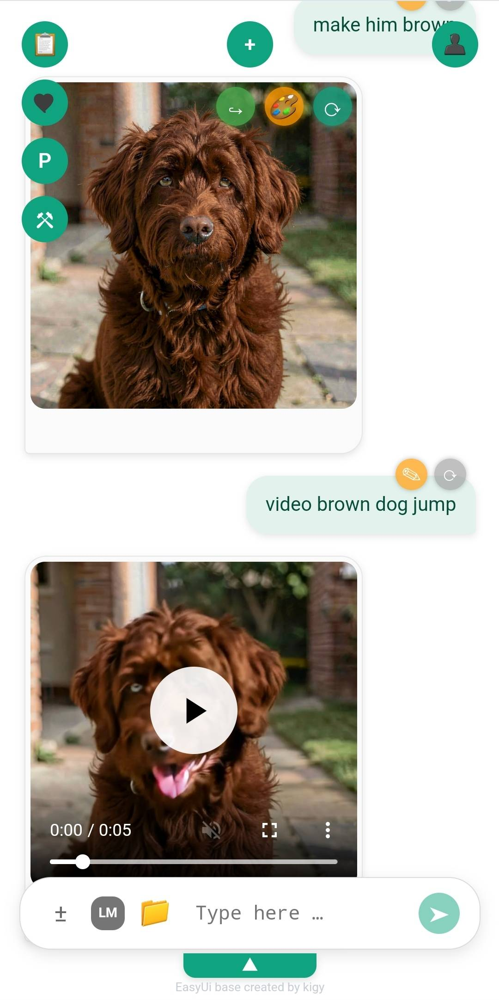


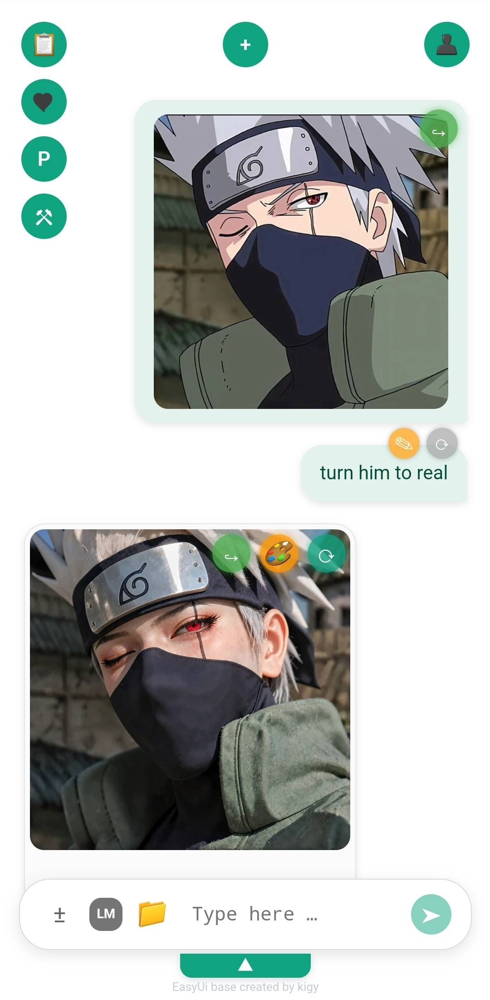  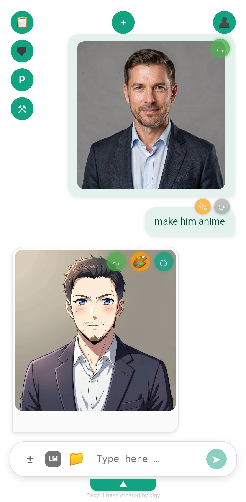

---

### img2txt , txt2txt , LLM
You can interact with language models, or also get predefined responses in two ways: either by writing the response directly in the intent file, or by using text files.
>Note: You must press the LM button to talk to a language model.

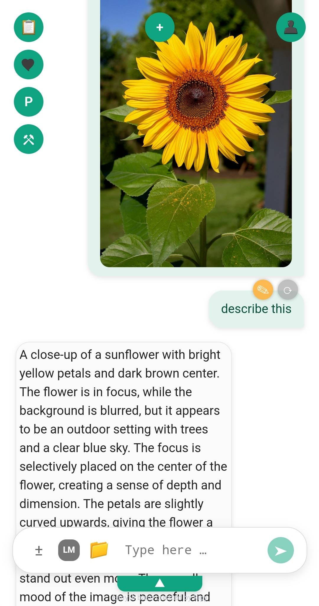  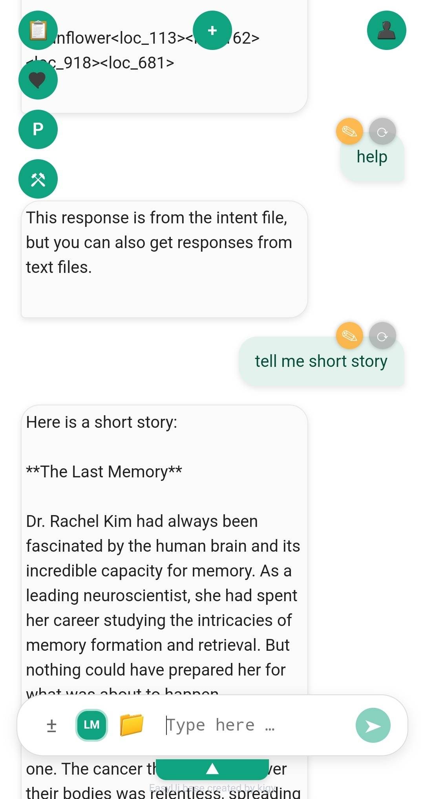

### sessions , user settings
>Note: Click (**Login**) to load user settings, and (**Save**) to apply any changes.

(**Delete All Media**) deletes all user media from the server (local PC).  
>Note: You need to add the ComfyUI path to comfy_path.txt to make it work.

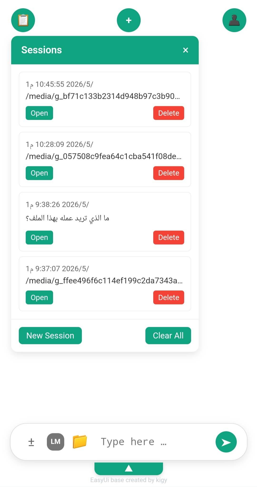  
---

### Buttons , Dark mode

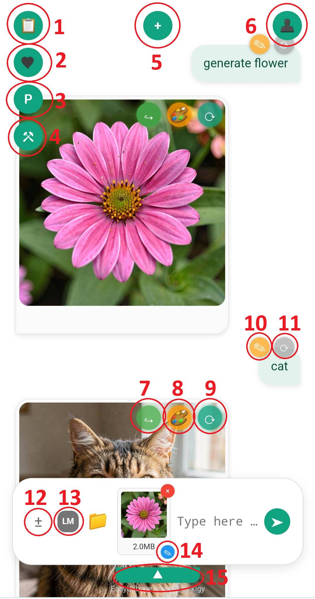  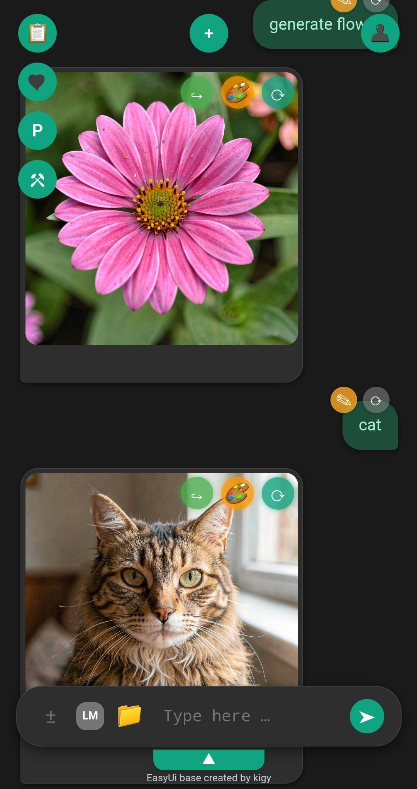

1. **manage sessions**.
2. **Favorite Templates**.
3. **my prompt** to save your favorite prompt [Go favorite prompt](#my-prompt).
4. **Plugin** (the ui accept plugin).[Go plugin](#plugin).
5. You can divide your workflow into three groups: **Fast**, **High**, and **Main**.   
Note: If the UI does not find the workflow in **Fast** or **High**, it will search in **Main** (the default).
6. **user settings** from here you can see all settings and dark mode.  
7. **send to bar** to reuse the image and send it to chat bar 
8. **open mask editor** helps you reuse an image for inpainting (draw and mask).
9. **Regenerate** with a different seed.
10. **edit & resend** edit your message.
11. **Resend** same message.
12. **postive/negative** The button helps you switch between positive and negative prompts.
13. **LM** enable chat with LLM
14. **Edit** open crop and mask editor [Go to Crop and Mask Editor](#crop-and-mask-editor)
15. **show and hide templates**
---

### Templates

**Templates** provide an easy way to organize workflows and applications and launch them using images.

> **Note:** You can create folders to organize templates into categories.

If you have many templates, each user can press the **heart button** to save it to their **Favorites**.

<details>
<summary>How to create a template</summary>

1. Place an **image** and a **text file** inside the `templates` folder (the image and text file must have the same name).
2. In the text file:
   - **First line:** the label (name shown in the UI)
   - **Second line:** the intent or prompt

</details> 


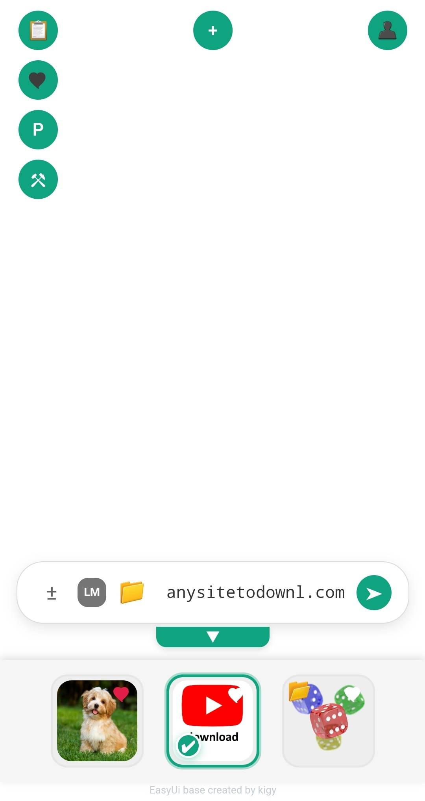  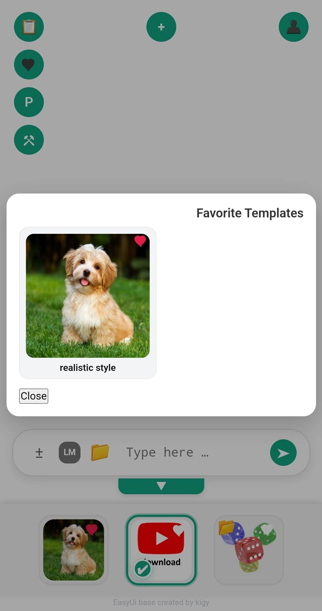
---

### crop and mask editor

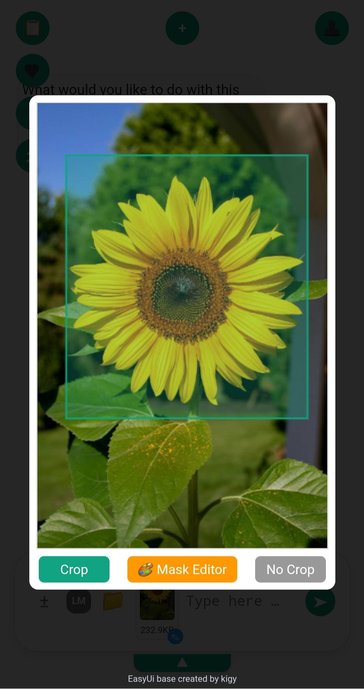  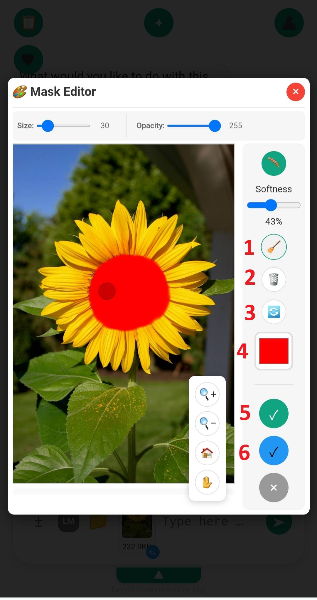

1. **Eraser**
2. **Clear All**
3. **Invert Mask**
4. **Change Color**
5. **Save Mask for Inpainting**
6. **Save Paint** (useful for drawing workflows)
---

### multi reference , vid2vid

This example uses two reference images: the first for Pose ControlNet, and the second for IP-Adapter.

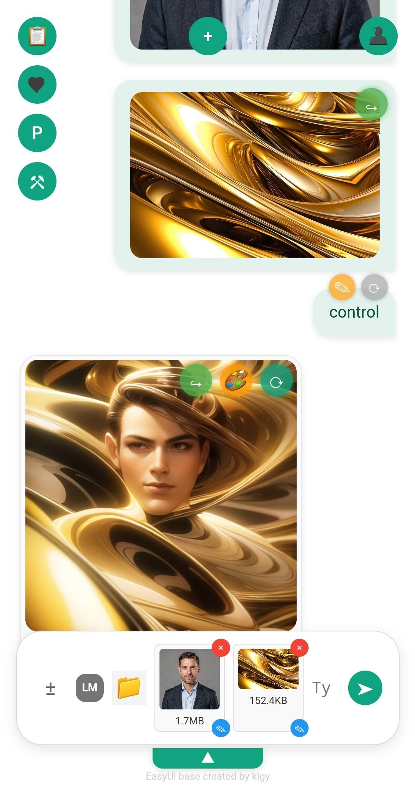 

---

### my prompt
a way to save your favorite prompt

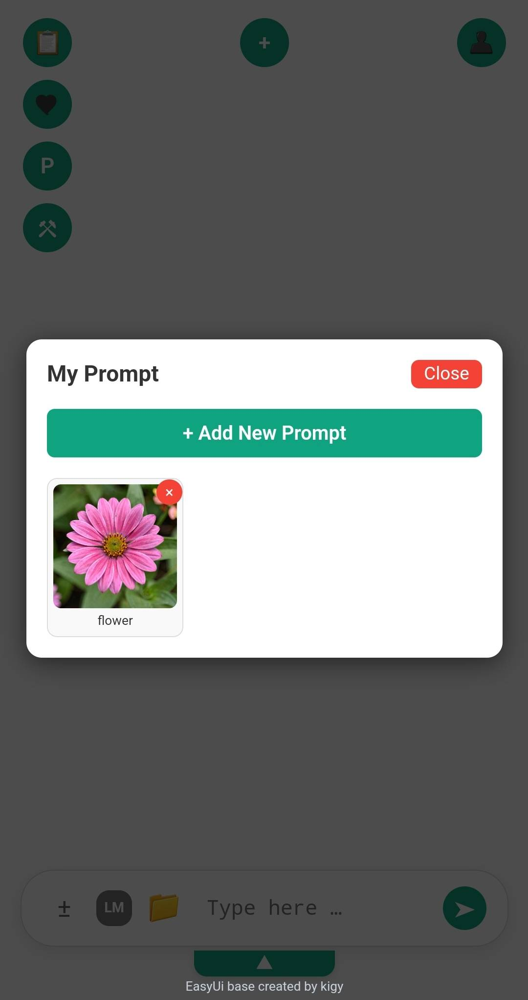 

---

### txt2voice , trim audio
clone voice and txt2voice

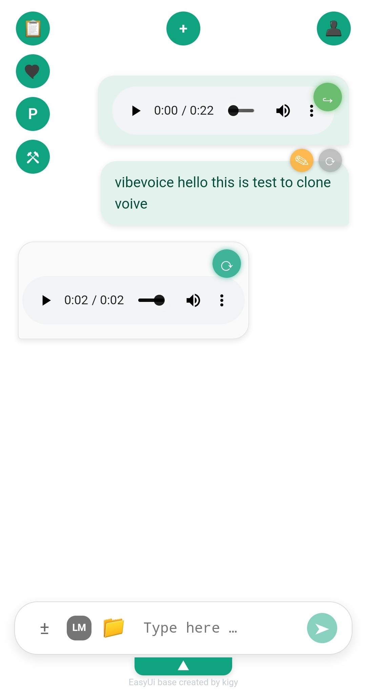  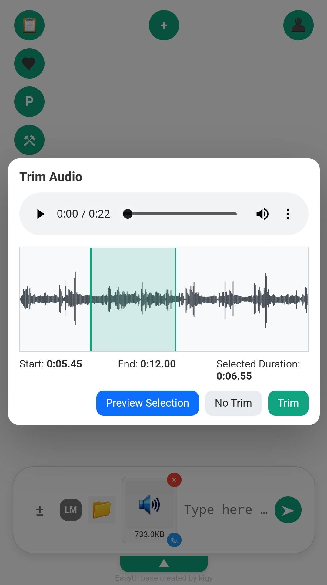

---

### Plugin
The UI accepts plugins.  
There are many types of plugins: some run automatically (enable/disable), while others require a click to run.  
Example: There are two plugins—one adds shortcuts to the interface, and the other controls the angle of the subject, which is useful when using LoRA to change the camera angle.  


>Note: I hope this will be a starting point to support all available applications.  

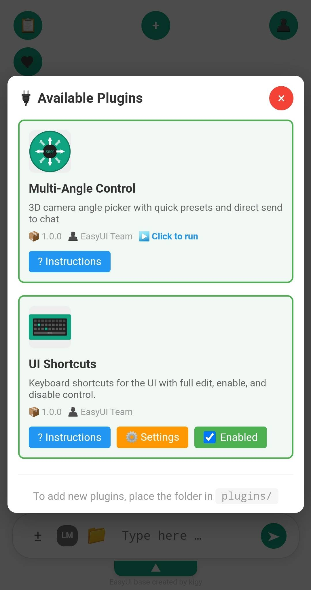  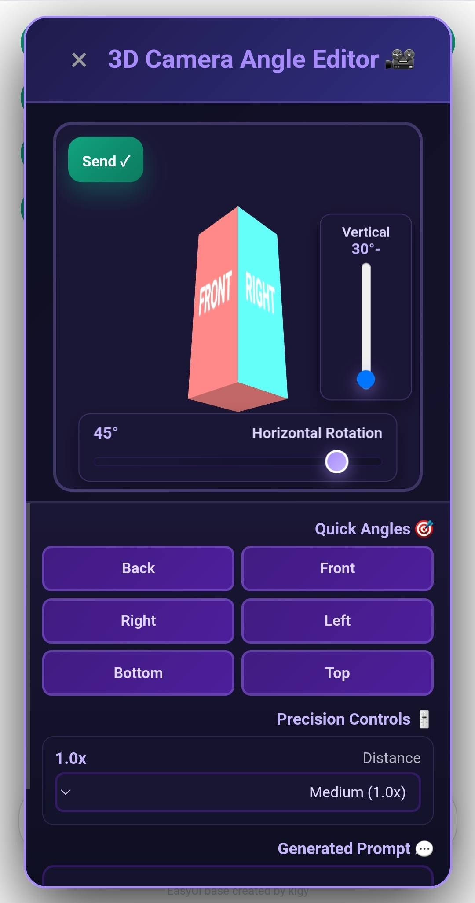

---


## Tag System Usage
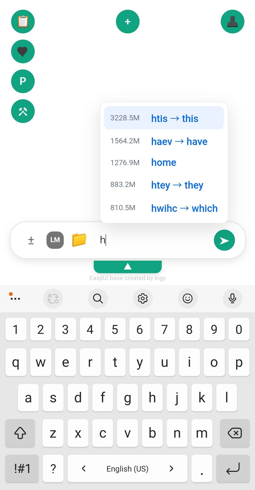

After placing files in the following directories:

```yaml
web/easy-tag/tags

web/easy-tag/wildcards

web/easy-tag/chants
```
>Note 1: You must convert **tags** and **chants** to JSON. You can use the `auto_csv_to_json` tool to convert from the tool file.  
>Note 2: When you add a new wildcard, you must update a manifest file using `update_wildcard.py` from wildcards file. 

### Tags
- Works directly when enabled in settings  
- Triggered by typing normally  

### Wildcards
- Activated when typing double underscores (`__`)

### Chants
- Works when typing: ##
- Note: It only appears after typing at least one character after ` ## `


---

## pythonapp 

**PythonApp** is a way to run Python code directly from the EasyUI.
For example, you can write code to download a video from a website, or create a script to copy text.   
`It’s Python`—so you can do whatever you want.

<details>
<summary>How to use</summary>

1. add intents to intents file like
```yaml
  pythonapp:
    file: null
    aliases:
    - pythonapp
    - runbat
```
</details> 
2. Place your Python script and '.bat' file inside the 'PythonApp' folder.<br>
3. To use it in EasyUI, type the intent. For example: 
 

```yaml
pythonapp file-name commands
```
---

## bad words file

You can also censor any unwanted words.
Add them to `bad_words.yml` like this:
```yaml
badword1: replace
badword2: replace
``` 

>Note: In my experience, replacing the word is better than removing it.


---

## responses file

You can add responses from a .txt file. Place the file inside the responses folder, then add an intent like this:
```yaml
  sec:
    response_file: sec.txt
    aliases:
    - sec
	- whatever you want
``` 


</details> 